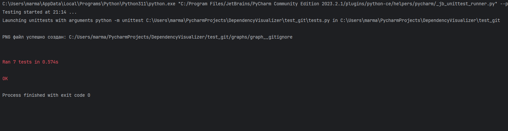

# Визуализатор графа зависимостей Git-репозитория

---

## Общее описание

Этот проект представляет собой инструмент для визуализации графа зависимостей в Git-репозитории. Он анализирует репозиторий, строит граф зависимостей между объектами Git (коммиты, деревья, блобы) и генерирует изображение (PNG) с помощью Graphviz.

---

## Конфигурация

Конфигурационный файл имеет формат json и содержит:
- Путь к локальной копии Git-репозитория.
- Название ветки репозитория, для которой строится граф зависимостей.
- Путь к программе для визуализации Graphviz (dot).
- Путь для сохранения выходных файлов (PNG).
- Имя целевого файла, зависимости которого будут выделены в графе.

---

## Описание функций

### Основные методы класса `DependencyVisualizer`

#### `__init__(self, config_path)`
- **Описание**: Загружает конфигурацию из JSON-файла.
- **Параметры**:
  - `config_path`: путь к конфигурационному файлу.

#### `parse_object(self, object_hash, description=None, author_data=None)`
- **Описание**: Извлекает информацию из Git-объекта по его хэшу.
- **Параметры**:
  - `object_hash`: Хэш Git-объекта.
  - `description`: Описание, которое будет добавлено к объекту (по желанию).
  - `author_data`: Данные об авторе коммита (по желанию).
- **Возвращаемое значение**: Словарь с данными об объекте и его детях.

#### `parse_commit(self, raw_content)`
- **Описание**: Парсит содержимое коммита Git.
- **Параметры**:
  - `raw_content`: Сырые данные коммита.
- **Возвращаемое значение**: Словарь с информацией о родительских коммитах, дереве и авторе.

#### `parse_tree(self, raw_content, author_data)`
- **Описание**: Парсит Git-объект типа `tree`, который описывает структуру директорий и файлов.
- **Параметры**:
  - `raw_content`: Сырые данные объекта типа `tree`.
  - `author_data`: Данные об авторе коммита.
- **Возвращаемое значение**: Список дочерних объектов, соответствующих файлам и подкаталогам.

#### `get_last_commit(self)`
- **Описание**: Получает хэш последнего коммита в указанной ветке.
- **Возвращаемое значение**: Хэш последнего коммита.

#### `add_one_to_parents_if_target_found(self, tree, target_file)`
- **Описание**: Рекурсивно добавляет '1' в начало label родительским узлам, если целевой файл найден в label одного из детей.
- **Параметры**:
  - `tree`: Дерево объектов Git.
  - `target_file`: Целевой файл, зависимости которого нужно отобразить.

#### `generate_dot_filtered(self, target_file, filename)`
- **Описание**: Генерирует DOT-файл для графа зависимостей, учитывая целевой файл.
- **Параметры**:
  - `target_file`: Целевой файл, зависимости которого нужно выделить.
  - `filename`: Путь для сохранения DOT-файла.

#### `generate_png_from_dot(self, dot_file_path, output_png_path)`
- **Описание**: Создает PNG-изображение графа зависимостей на основе DOT-файла.
- **Параметры**:
  - `dot_file_path`: Путь к DOT-файлу.
  - `output_png_path`: Путь для сохранения PNG-изображения.

---

## Примеры использования

---

## Результаты тестирования

